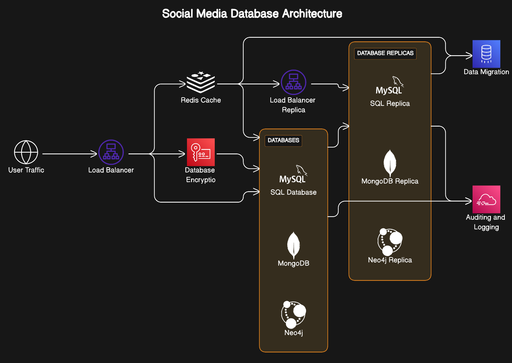
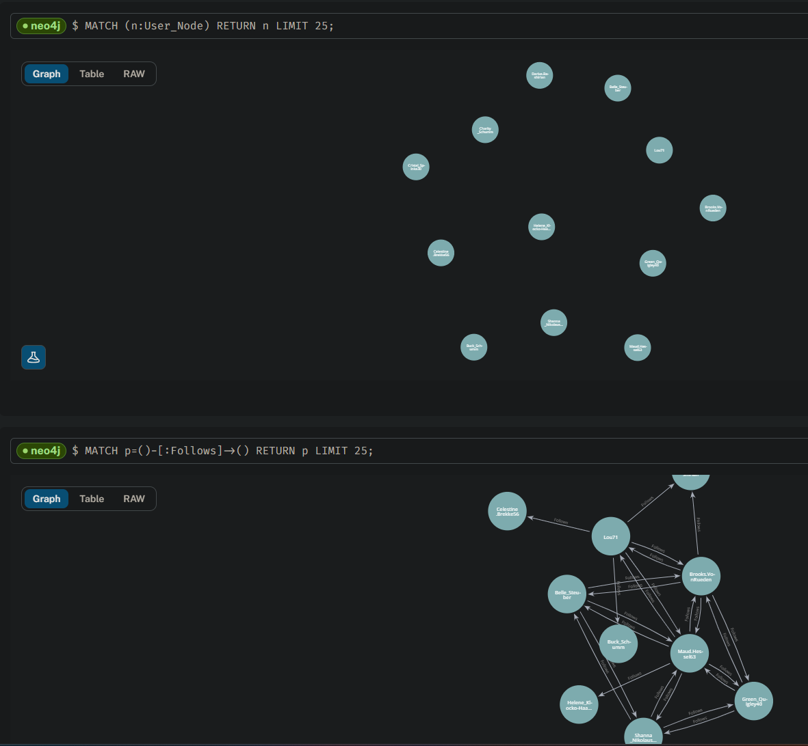
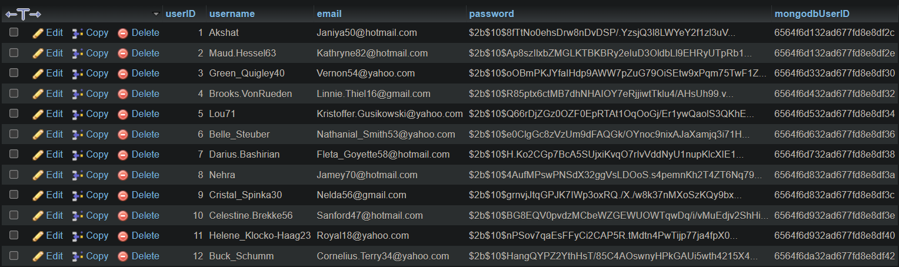
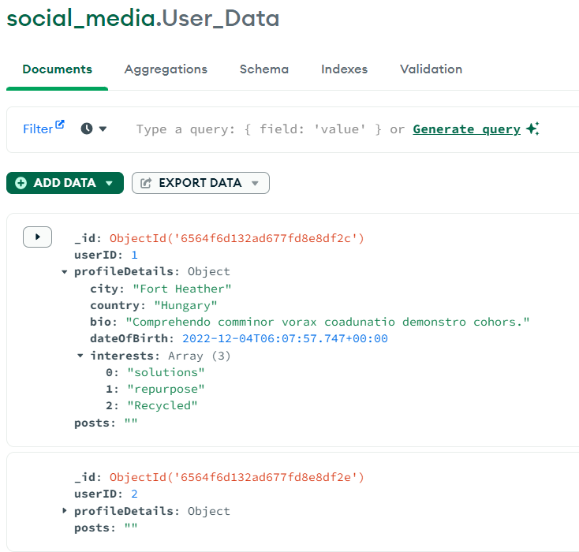
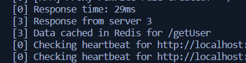
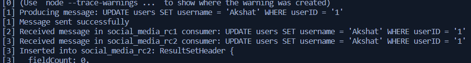
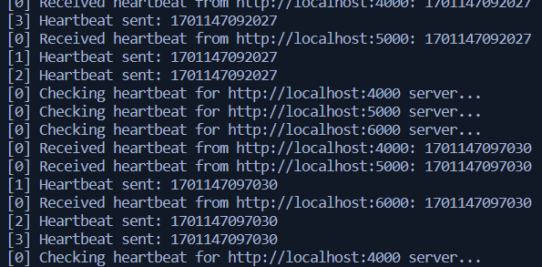
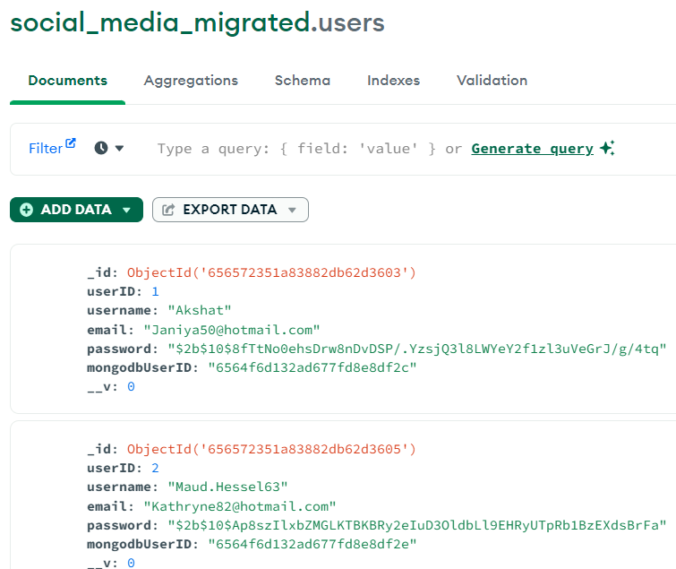
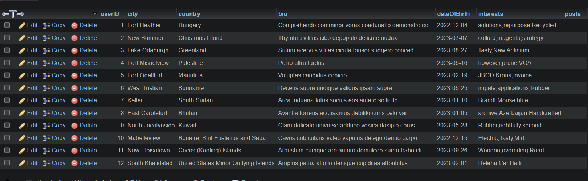

Abstract—The project presents a multi-database architecture, strategically integrating MySQL, MongoDB, and Neo4j to elevate data management systems efficiency and reliability. Core features encompass encryption for data security, a scripted filler for automatic data population for testing, SMS alerts for system concerns, Redis cache optimization, and Kafka-driven data synchronization that can support both eventual and instant consistency. Load balancing, cache management, and robust data migration further contribute to fault tolerance and real-time responsiveness. The report provides a comprehensive overview, spanning architecture design, infrastructure setup, schema design, and meticulous testing, ensuring a seamless user experience.

1. INTRODUCTION AND MOTIVATION

The relentless evolution of data management systems presents a compelling need for innovative solutions. In this context, our report embarks on a journey to dissect the challenges encapsulated in contemporary data architectures. Despite the prevalence of existing systems, they grapple with the escalating complexities of rapid data growth and the intricate integration of diverse databases. Our motivation to introduce a novel model is deeply rooted in the discerned gaps within these prevalent solutions. Specifically, the existing architectures often fall short in achieving an optimal equilibrium between performance, seamless data migration, and sustained continuity. This inadequacy becomes particularly pronounced in the context of modern social media platforms, prompting the development of our comprehensive model. In essence, our approach stands as a deliberate response to the identified shortcomings in traditional methodologies, promising an innovative, adaptive, and efficient solution for the challenges posed by the multifaceted landscape of contemporary data management.

2. BACKGROUND STUDY AND RELATED WORKS

This section critically examines the landscape of prior research efforts in the realm of contemporary data management systems, aiming to distinguish these efforts from the unique contributions of the proposed multi-database architecture. By undertaking a comprehensive review, we contextualize our model within the broader evolution of solutions in this domain.

The journey begins with an exploration of seminal works and key research papers that have laid the foundation for understanding the challenges and innovations in data management. Notable contributions from esteemed scholars and researchers have been pivotal in shaping the discourse around issues like rapid data growth, diverse database integration, and the quest for enhanced user experience.

A meticulous summary of related papers provides a nuanced understanding of the evolving trends and methodologies in the field. Each paper serves as a stepping stone, contributing valuable insights that have collectively sculpted the landscape of contemporary database management solutions. We juxtapose these existing works against the distinctive features and innovations embedded in our proposed multi-database architecture.

Through this analysis, we aim to highlight the gaps and limitations in current solutions, setting the stage for the introduction of our novel model. By synthesizing prior research with our unique contributions, we position our work within the broader context of advancements in data management, providing a foundation for the subsequent detailed exploration of the proposed architecture in this report.

Beyond academic endeavors, our study extends to a practical investigation into the architectures of prominent platforms such as Instagram, Twitter, and Facebook. By scrutinizing their decision-making processes and technology choices, we gain valuable insights into the mindset required for effective data management in dynamic and demanding environments. This multifaceted approach positions our research at the forefront of innovation, combining theoretical foundations with real-world considerations.

3. PROPOSED MODEL

In our relentless pursuit of crafting a resilient and efficient cloud infrastructure for a dynamic social media platform, we lay the foundations for a user-centric experience guided by cutting-edge cloud architecture. The user's interactions with the system commence at the Load Balancer, a pivotal component that employs a sophisticated algorithm. Traffic is intelligently redirected to the database server with the least number of active connections, ensuring an even utilization of all available resources and optimizing system performance.

Once past the Load Balancer, requests embark on a journey that leverages the power of the Redis cache. This dedicated Redis cache server serves as the linchpin for the system, significantly enhancing the system's ability to manage read heavy operations. Frequently accessed data is strategically cached, mitigating the need for repeated retrieval from the original source and resulting in remarkably improved query response times.

Our architectural blueprint takes shape through the judicious incorporation of Relational (MySQL), Document (MongoDB), and Graph (Neo4j) databases, each contributing to the overall efficiency of the system. These databases are meticulously structured and equipped with horizontal partitioning and sharding capabilities (MySQL and MongoDB). The implementation of these strategies ensures the effective distribution of data across multiple servers, elevating query performance to a level of unparalleled efficiency.

High availability stands as a cornerstone of our architectural design. Through the deployment of database replicas, we

Fig. 1. Social Media Advanced Database Architecture

ensure uninterrupted service and fault tolerance. A secondary Load Balancer plays the role of the conductor, evenly directing ”read-heavy” traffic to these replicas. The system operates under the banner of strong consistency, achieving data uniformity and enhancing efficiency by directing read requests to the replicas first. Furthermore, these databases engage in periodic synchronization to safeguard data consistency, even in the face of potential challenges.

The architecture's robustness is further underscored by the foresight to empower database replicas with the ability to send continuous operational signals to the central server. In the event of a primary database failure, a random replica is poised to seamlessly take the reins, ensuring uninterrupted service for our users.

Data Migration is seamlessly woven into our architectural tapestry. This feature orchestrates the smooth transition of data between databases, providing the agility required for system upgrades and data consolidation. We have created scripts to convert MySQL databases to MongoDB and vice versa, anticipating scenarios where a decision might be made to migrate to a different database. The integrity of data remains paramount, and data migration is executed with a laser focus on minimizing data loss during this essential process.

As we ascend the summit of cloud architecture, we fortify the framework with an impregnable layer of security. Database Encryption stands as the sentry guarding data, both at rest and in transit, while Auditing and Logging mechanisms tirelessly keep watch over the system's activities. This emphasis on security, compliance, and troubleshooting is essential, ensuring that data remains protected.

Adding another layer of sophistication, we introduce Kafka, a robust messaging system. In our ecosystem, the master database acts as the producer of queries, pushing them to the message queue. The read replicas, or slaves, fetch these queries from the queue, updating themselves in a synchronized fashion. This Kafka-driven architecture ensures seamless communication and synchronization between the master and its replicas.

Fig. 2. Neo4j Database

Fig. 3. mySQL Database

In our commitment to real-time responsiveness, we implement an auto-expiry feature for the cache. This deliberate choice is made to ensure that cached data remains fresh and reflective of real-time changes, aligning with our pursuit of optimal user experiences. Additionally, we incorporate an SMS alert system using the Twilio API to notify administrators in case of any failure or alarming situation, such as when query times exceed a predefined threshold. This proactive alerting mechanism enhances the system's robustness and aids in a swift response to potential issues.

In essence, our cloud architecture stands as a testament to innovation and foresight, where each component is intricately designed to contribute to the system's efficiency, resilience, and user satisfaction.

4. RESULTS AND FIGURES

This section unveils the tangible outcomes derived from the implementation of the proposed multi-database architecture. The presentation includes essential figures, diagrams, and charts that serve as visual aids to convey the effectiveness and impact of our model.

Generating Dummy Data and Populating Databases: Figure 2, 3, and 4 showcase the successful generation of dummy data

Fig. 4. MongoDB Database

Fig. 5. SMS Alert

and its population across all databases. This process is crucial for testing and simulating real-world scenarios, ensuring that our architecture can handle diverse data loads.

SMS Alert for Server Concerns: Figure 5 displays screenshots of SMS alerts generated in response to server concerns. In the event of server downtime or a significant increase in response time beyond a defined threshold, our system sends real-time alerts. These messages, as depicted in the figure, provide essential notifications to administrators, enabling prompt action to address server issues.

Reading from Redis Cache: Figure 6 captures a screenshot from the console, highlighting the retrieval of data from the Redis cache. This feature significantly enhances response

Fig. 6. Redis

Fig. 7. Kafka Database Synchronization

Fig. 8. Load Balancing

times by caching frequently accessed data, reducing the need for repeated retrieval from the original source.

Data Synchronization using Kafka: Figure 7 illustrates the data synchronization process facilitated by Kafka. The console screenshot showcases the production and successful consumption of messages, ensuring that all databases maintain consistency in real-time.

Load Balancing and Heartbeat Signal: Figure 8 demonstrates the load balancing mechanism and the exchange of heartbeat signals between servers and the master database. The console logs reveal the efficient distribution of incoming traffic across multiple servers, optimizing resource utilization and ensuring a consistent high-speed performance.

Data Migration Scripts: Figures 9 and 10 depict the successful execution of data migration scripts, converting databases

Fig. 9. mySQL to mongodb

Fig. 10. MongoDB to mySQL

between MySQL and MongoDB seamlessly. This feature allows for agile system upgrades and changes, showcasing our architecture's adaptability.

These figures and charts serve as integral components in substantiating the results of the project, providing a visual representation of the architecture's functionality and its direct impact on system performance and user experience. Detailed explanations accompany each visual element, ensuring a comprehensive understanding of the achieved outcomes.

5. LIMITATIONS OR CHALLENGES

Implementing our advanced multi-database architecture has brought to light various challenges and limitations, each requiring thoughtful consideration and strategic responses. A central challenge was the seamless integration of diverse technologies, necessitating meticulous coordination to ensure the smooth interaction of each component. This task demanded a deep understanding of the intricacies of each technology and how they complemented one another within the architecture.

The selection of optimal technologies emerged as another complex challenge. It involved extensive research and a thorough analysis of existing systems, considering factors such as performance, scalability, and trade-offs. The need to make informed decisions about when to deploy specifictechnologies added an additional layer of complexity to the project.

Managing multiple databases and their replicas presented challenges related to coordination and synchronization. The intricacies of data migration, a critical aspect of our system, brought forth concerns about the risk of data loss or corruption during transitions. Rigorous testing and the development of precise migration scripts were essential to mitigate these risks.

Resource management complexities surfaced during the project, requiring the fine-tuning of strategies to optimize server usage and prevent performance bottlenecks. The efficient integration of diverse data sources, especially in crossreferencing, presented ongoing challenges that demanded continuous optimization strategies, such as leveraging indexes and caching.

Scalability, while a strength of our architecture, also introduces challenges. As data volumes and user traffic increase, extensive scalability testing becomes imperative to ensure consistent performance. In dynamic environments, unexpected surges in data or user activity might pose challenges that need to be addressed proactively.

Addressing security concerns emerged as a crucial aspect, particularly in ensuring the secure transmission and storage

of user data. The ever-evolving landscape of security threats demanded continuous vigilance, with regular updates and adherence to best practices being essential for safeguarding user data effectively.

Furthermore, the reliance on external services, such as Twilio for SMS alerts, introduces dependencies that could impact the system's reliability. External factors, such as service outages or changes in API specifications, may affect the responsiveness of certain features, highlighting the need for contingency plans and continuous monitoring.

While we have implemented encryption mechanisms for data security, it is crucial to acknowledge the ever-evolving nature of cybersecurity threats. Continuous adaptation to emerging security challenges is imperative, emphasizing the importance of ongoing updates and adherence to the latest security practices.

Throughout the project's execution, we transparently acknowledged these challenges. We recognize the need for ongoing refinements and iterative improvements to enhance the real-world applicability of our advanced multi-database architecture. Each challenge encountered has provided valuable insights, contributing to the continuous evolution and optimization of our innovative solution.

6. CONCLUSIONS AND FUTURE WORK

This concluding section encapsulates the key findings and implications derived from the implementation of the proposed multi-database architecture, underscoring the essence of the report.

Key Findings: Implementation of our advanced multidatabase architecture reveal a transformative impact on modern data management. Through seamless integration of MySQL, MongoDB, and Neo4j, our model ensures efficient load balancing, real-time responsiveness, and fault tolerance. Leveraging Redis for caching optimizes performance, while Kafka facilitates data synchronization for both eventual and instant consistency. The emphasis on data security is evident with features like database encryption, auditing, and logging. High availability is maintained through database replicas and periodic synchronization. The model's success is underscored by a comprehensive workflow, ensuring optimal performance and reliability. Overall, our architecture emerges as a benchmark for addressing the challenges of contemporary data management effectively.

Implications: The fault-tolerant mechanisms and strong emphasis on data consistency contribute to system reliability, setting a benchmark for innovative approaches in the field. By addressing challenges related to diverse database integration, rapid data growth, and user expectations, our model presents a holistic solution that harmonizes different database systems. The key takeaway is the potential for our architecture to reshape the landscape of contemporary data management, influencing how future systems approach the complexities of data-intensive platforms. The successful implementation and its implications position our project as a dynamic and evolving solution, impacting not only current database management practices but also influencing the future direction of the field.

Future Work: While the current implementation marks a substantial step forward, there are avenues for future improvements and extensions to the model:

Enhanced Load Balancing: Implementing more sophisticated load balancing algorithms to further optimize resource utilization and ensure consistent high-speed performance during peak usage.

Advanced Security Measures: Continuously evolving security threats demand ongoing enhancement of encryption mechanisms and security protocols to safeguard user data effectively.

Machine Learning Integration: Exploring the integration of machine learning algorithms to enhance predictive analytics and user-specific content recommendations, further enriching the user experience.

Scalability Testing: Conducting extensive scalability testing to assess the architecture's performance and reliability under conditions of increasing data volumes and user traffic.

Community and Stakeholder Feedback: Engaging with the user community and stakeholders to gather feedback and insights for iterative improvements and addressing specific user needs.

In conclusion, the proposed multi-database architecture demonstrates its potential to reshape the landscape of contemporary data management. Its successful implementation, coupled with outlined future directions, positions this model as a dynamic and evolving solution for the ever-changing demands of data-intensive platforms. The collaborative efforts of the team, combined with the lessons learned during this project, pave the way for a continued journey towards database management excellence.

REFERENCES

1. Educative. ”Design Instagram - System Design Interview Prep Crash Course.” Educative, Available: https://www.educative.io/courses/system-design-interview-prep-crash-course/design-instagram
2. GeeksforGeeks. ”How to Design a Scalable System Like Instagram?” GeeksforGeeks, Available: https://www.geeksforgeeks.org/design-scalable-system-like-instagram/ [3] High Scalability. ”Category: Example.” Available: http://highscalability.com/blog/category/example
